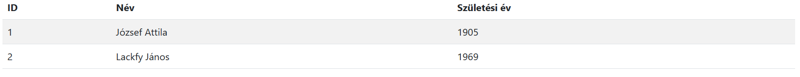

# RESTFull kezdemény JSON fájlból

## 1. lépés JSON fájlból adatok megjelenítése

Axios használatával MVC modell

1. DataService osztály a modellben 
2. Controllerben példányosítunk
3. Meghívhuj az Axios get metódutást, paraméterek: végpont, callback, függvény
4. A callback függvényben pédányosítjuk a View-t - TablaView
5. TablaView példányosítja a sorokat

